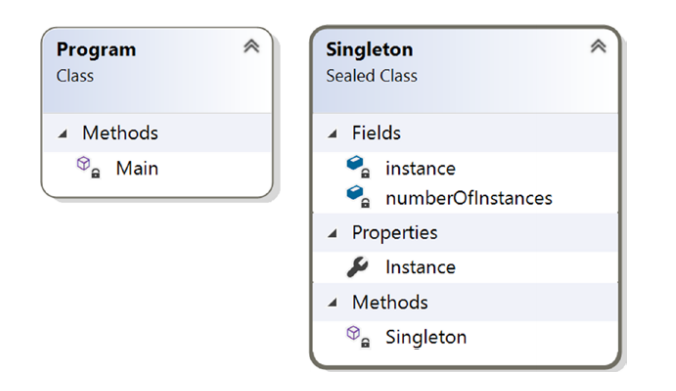

# Chapter 2: Prototype Pattern

## GoF Definition

Xác định các kiểu của các object muốn tạo ra bằng cách sử dụng một prototype \(khuôn mẫu, nguyên mẫu\), và tạo ra những object mới bằng cách sao chép prototype này.

## Khái niệm

Mẫu Prototype cung cấp một phương thức thay thế cho việc khởi tạo các đối tượng mới, bằng cách sao chép hoặc nhân bản một instance của một đối tượng hiện có. Điều này có thể giúp giảm thiểu chi phí khi tạo một instance mới bằng cách sử dụng khái niệm này.

## Ví dụ thực tế

Giả sử bạn chỉ có 1 bản sao chính của một tài liệu giá trị, bạn muốn thử thay đổi một vài thứ và cần xem xét ảnh hưởng của sự thay đổi. Trong trường hợp này, bạn có thể tạo ra một bản copy của tài liệu gốc và chỉnh sửa thay đổi trên đó.

## Ví dụ chuyên ngành

Cứ cho là bạn đã có một ứng dụng ổn định. Trong tương lai, bạn có thể muốn chỉnh sửa ứng dụng với một vài thay đổi nhỏ. Bạn phải bắt đầu với một bản copy của ứng dụng gốc, thay đổi nó, rồi phân tích thêm. Chắc là bạn sẽ không muốn viết lại ứng dụng hoàn toàn từ đầu để chỉ thử một vài thay đổi nhỏ xíu. Việc này sẽ chôm của bạn rất nhiều thời gian và tiền bạc, tôi cá luôn.

## Minh họa và giải thích

Trong ví dụ minh họa này, tôi sẽ làm theo structure \(cấu trúc, kiến trúc\) được trình bày trong hình 2-1 ngày bên dưới:


Ở đây, _`BasicCar`_là một prototype, _`Nano`_ và _`Ford`_ là concrete prototypes \(những khuôn mẫu cụ thể\), và chúng đã được implement phương thức _`Clone()`_- là phương thức đã được định nghĩa trong _`BasicCar.`_ Hãy chú ý rằng trong ví dụ này tôi đã tạo một object _`BasicCar`_ với một vài price \(giá tiền\) mặt định. Sau đó tôi chỉnh sửa price cho mỗi model. _`Program.cs`_ là thứ được dùng để chạy chương trình chắc ai cũng biết rồi.

### Class Diagram


### Directed Graph Document \(Đồ thị có hướng\)



### Solution Explorer View


### Giờ code đến rồi

```csharp
//BasicCar.cs
using System;
namespace PrototypePattern
{
    public abstract class BasicCar
    {
        public string ModelName { get; set; }
        public int Price { get; set; }
        public static int SetPrice()
        {
            int price = 0;
            Random r = new Random();
            int p = r.Next(200000, 500000);
            price = p;
            return price;
        }
        public abstract BasicCar Clone();
    }
}

//Nano.cs
using System;
namespace PrototypePattern
{
    public class Nano : BasicCar
    {
        public Nano(string m)
        {
            ModelName = m;
        }
        public override BasicCar Clone()
        {
            return (Nano)this.MemberwiseClone();//shallow Clone
        }
    }
}

//Ford.cs
using System;
namespace PrototypePattern
{
    public class Ford : BasicCar
    {
        public Ford(string m)
        {
            ModelName = m;
        }
        public override BasicCar Clone()
        {
            return (Ford)this.MemberwiseClone();
        }
    }
}

//Client
using System;
namespace PrototypePattern
{
    class Program
    {
        static void Main(string[] args)
        {
            Console.WriteLine("***Prototype Pattern Demo***\n");
            //Base or Original Copy
            BasicCar nano_base = new Nano("Green Nano") { Price = 100000 };
            BasicCar ford_base = new Ford("Ford Yellow") { Price = 500000 };

            BasicCar bc1;
            //Nano
            bc1 = nano_base.Clone();
            bc1.Price = nano_base.Price + BasicCar.SetPrice();
            Console.WriteLine("Car is: {0}, and it's price is Rs. {1}", 
                                bc1.ModelName,
                                bc1.Price);

            //Ford
            bc1 = ford_base.Clone();
            bc1.Price = ford_base.Price + BasicCar.SetPrice();
            Console.WriteLine("Car is: {0}, and it's price is Rs. {1}", 
                                bc1.ModelName, 
                                bc1.Price);
            Console.ReadLine();
        }
    }
}
```

### Output

```text
***Prototype Pattern Demo***
Car is: Green Nano, and it's price is Rs. 486026
Car is: Ford Yellow, and it's price is Rs. 886026
```


Chú ý: Bạn có thể thấy sự khác biệt về price trên máy của bạn bởi vì chỗ này tôi generate một price  ngẫu nhiên trong phương thức _`SetPrice()`_ bên trong _`BasicCar`_ class. Nhưng tôi đã đảm bảo rằng price của _`Ford`_ sẽ lớn hơn _`Nano`._


## Q&A Session

1. **Lợi ích của việc dùng mẫu thiết kế Prototype?**
   * Bạn có thể đưa thêm vào hoặc loại bỏ các product lúc runtime
   * Trong một vài bối cảnh, bạn có thể tạo mới các instance với chi phí rẻ hơn
   * Tập trung vào việc thay đổi, tùy biến hơn là lo lắng về sự phức tạo trong quá trình tạo ra một instance mới.
   * Lúc viết code để thực thi ứng dụng thì không cần lo việc tạo ra object, chỉ cần copy object đã có. 
2. **Sử dụng mẫu thiết kế Prototype thì có những thử thách, khó khăn gì không?**
   * Các lớp con phải thực hiện cơ chế nhân bản hoặc sao chép.
   * Việc thực hiện cơ chế nhân bản có thể sẽ rất thử thách nếu như các object đang xem xét không hỗ trợ cơ chế sao chép hoặc nếu có các circular reference \(tham chiếu vòng - cái này phụ thuộc cái kia\)
   * Trong ví dụ minh họa này, tôi đã sử dụng phương thức _**`MemberwiseClone()`**_ , nó sẽ thi hành cơ chế _**`shallow copy`**_ trong C\#. Thật ra, nó tạo một object rồi copy các field _**`nonstatic`**_ của  object hiện tại vào một object mới. 

     MSDN nói thêm rằng:

     _`For a value type field, it performs a bit-by-bit copy, but for a reference type field, the references are copied but referred objects are not copied. So, the original object and the cloned object both refer to the same object. If you need a deep copy in your application, that can be expensive.`_  
     Tham khảo thêm về shallow copy và deep copy: 


## Tham khảo thêm

* [https://kipalog.com/posts/Design-Pattern--Prototype-Pattern---C-](https://kipalog.com/posts/Design-Pattern--Prototype-Pattern---C-)
* [https://www.dotnettricks.com/learn/designpatterns/prototype-design-pattern-dotnet](https://www.dotnettricks.com/learn/designpatterns/prototype-design-pattern-dotnet)
* [http://thachleblog.com/shallow-copy-va-deep-copy/](http://thachleblog.com/shallow-copy-va-deep-copy/)


