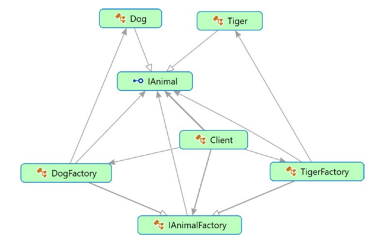
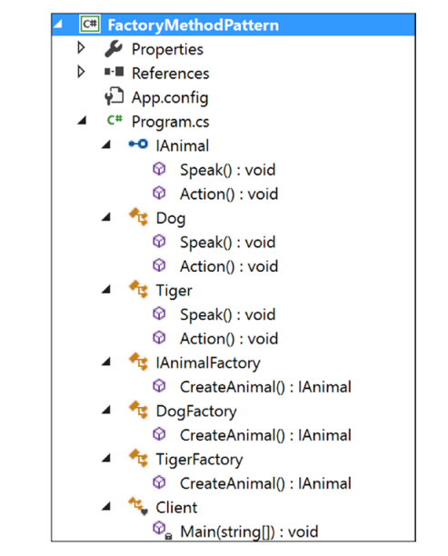
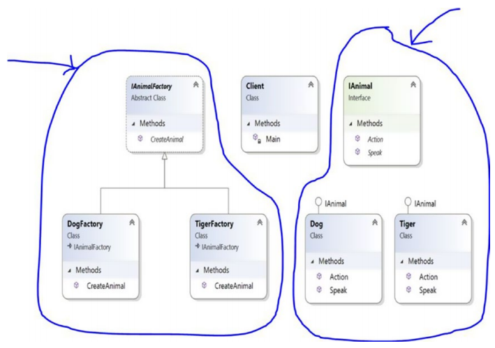

# Chapter 4: Factory Method Pattern

## GoF Definition

Định nghĩa một giao diện \(interface\) cho việc tạo một đối tượng, nhưng để các lớp con quyết định cái gì sẽ được tạo.


**Note:** Để hiểu mẫu thiết kế này, tôi đề nghị bạn tham khảo [Chapter 24: Simple Factory pattern](../../part-ii-additional-design-patterns/chapter-24-simple-factory-pattern.md). Mẫu thiết kế _`Simple Factory`_ không thuộc các mẫu thiết kế của GOF, cho nên việc thảo luận về mẫu _`Simple Factory`_ sẽ được để trong phần 2 của tài liệu này. Mẫu _`Factory Method`_ sẽ rõ nghĩa hơn nếu bạn đã hiểu điểm mạnh điểm yếu của mẫu _`Simple Factory`_ 


## Khái niệm

Tốt hơn là mô tả khái niệm của mẫu này thông qua ví dụ, nhưng đại khái có thể hiểu như vầy: 

> Factory Method định nghĩa một method cho việc tạo đối tượng, và các lớp con hoặc là kế thừa hoặc là override để chỉ rõ đối tượng nào sẽ được tạo và tạo như thế nào.

## Ví dụ thực tế

Trong một nhà hàng, dựa vào sở thích, khẩu vị, yêu cầu của từng khách hàng mà đầu bếp sẽ thay đổi nguyên liệu/hương vị của món ăn để phục vụ thực khách đó.

## Ví dụ chuyên ngành

Trong một ứng dụng, rất có thể bạn sử dụng nhiều loại database khác nhau cho người dùng khác nhau, ví dụ như một người thì dùng Oracle, người khác bạn lại dùng Sql Server. Bất cứ khi nào bạn cần thêm data vào database, bạn cần tạo ra hoặc là một _`SqlConnection`_ hoặc là một _`OracleConnection`_. Nếu bạn đặt code của mình vào câu lệnh _`if...else...`_ \(hoặc _`switch`_\), bạn sẽ phải viết rất nhiều code lặp đi lặp lại, điều này không dễ để maintain \(bảo trì\). Giả sử sau này bạn cần làm việc với một kiểu database khác ví dụ MySql, lúc đó sẽ là thảm họa. Mẫu thiết kế _`Factory Method`_ này sẽ giúp bạn giải quyết kiểu vấn đề như vậy.

## Minh họa và giải thích

Ở đây chúng ta sẽ dùng một lớp trừu tượng_`IAnimalFactory`_ . Theo định nghĩa, quá trình khởi tạo sẽ được thực hiện thông qua các lớp con được dẫn xuất từ lớp trừu tượng này.

### Class Diagram


### Directed Graph Document



### Solution Explorer View



### Viết code thôi!

```csharp
using System;
namespace FactoryMethodPattern
{
    public interface IAnimal
    {
        void Speak();
        void Action();
    }

    public class Dog : IAnimal
    {
        public void Speak()
        {
            Console.WriteLine("Dog says: Bow-Wow.");
        }
        public void Action()
        {
            Console.WriteLine("Dogs prefer barking...\n");
        }
    }

    public class Tiger : IAnimal
    {
        public void Speak()
        {
            Console.WriteLine("Tiger says: Halum.");
        }
        public void Action()
        {
            Console.WriteLine("Tigers prefer hunting...\n");
        }
    }

    public abstract class IAnimalFactory
    {
        //Remember the GoF definition which says "....Factory method lets a class
        //defer instantiation to subclasses." Following method will create a Tiger
        //or Dog But at this point it does not know whether it will get a Dog or a
        //Tiger. It will be decided by the subclasses i.e.DogFactory or TigerFactory.
        //So, the following method is acting like a factory (of creation).
        public abstract IAnimal CreateAnimal();
    }

    public class DogFactory : IAnimalFactory
    {
        public override IAnimal CreateAnimal()
        {
            //Creating a Dog
            return new Dog();
        }
    }

    public class TigerFactory : IAnimalFactory
    {
        public override IAnimal CreateAnimal()
        {
            //Creating a Tiger
            return new Tiger();
        }
    }

    class Client
    {
        static void Main(string[] args)
        {
            Console.WriteLine("***Factory Pattern Demo***\n");
            // Creating a Tiger Factory
            IAnimalFactory tigerFactory = new TigerFactory();
            // Creating a tiger using the Factory Method
            IAnimal aTiger = tigerFactory.CreateAnimal();
            aTiger.Speak();
            aTiger.Action();
            // Creating a DogFactory
            IAnimalFactory dogFactory = new DogFactory();
            // Creating a dog using the Factory Method
            IAnimal aDog = dogFactory.CreateAnimal();
            aDog.Speak();
            aDog.Action();
            Console.ReadKey();
        }
    }
}
```

### Output

```text
***Factory Pattern Demo***

Tiger says: Halum.
Tigers prefer hunting...

Dog says: Bow-Wow.
Dogs prefer barking...
```

### Thực hiện sửa đổi

Trong lần sửa đổi này, chúng ta sẽ làm cho đoạn code tăng tính linh hoạt. Chú ý là, class _`IAnimalFactory`_ là một lớp trừu tượng \(abstract\), do đó bạn có thể tận dụng mọi lợi thế của nó. Giả sử rằng bạn muốn một lớp con tuân theo qui tắc mà lớp cha \( hoặc _`base class`_ - lớp cơ sở \) đã qui định. Tôi đã thử code cho tình huống như vậy, dưới đây là những ý chính:

* Chỉ _`AnimalFactory`_ được sửa đổi, nói cách khác, tôi đang đề cập đến một phương thức mới gọi là _`MakeAnimal()`_ .

  ```csharp
  //Modifying the IAnimalFactory class.
  public abstract class IAnimalFactory
  {
      public IAnimal MakeAnimal()
      {
          Console.WriteLine("\n IAnimalFactory.MakeAnimal() " +
                      "-You cannot ignore parent rules.");
         
          /*
          Tới thời điểm này, nó chả biết khi nào sẽ là một con Dog hay một con Tiger.
          Nó sẽ được quyết định bởi các lớp con, ví dụ DogFactory hoặc TigerFactory. 
          Nhưng nó biết là nó sẽ thực hiện 2 hành động Speak() và Action()
          */

          IAnimal animal = CreateAnimal();
          animal.Speak();
          animal.Action();
        
          return animal;
      }

      //So, the following method is acting like a factory
      //(of creation).
      public abstract IAnimal CreateAnimal();
  }
  ```

* Tôi cũng thay đổi một chú code client \( _`Main()`_ method \):

  ```csharp
  class Client
  {
      static void Main(string[] args)
      {
          Console.WriteLine("***Beautification to Factory Pattern Demo * **\n");

          // Creating a tiger using the Factory Method
          IAnimalFactory tigerFactory = new TigerFactory();
          IAnimal aTiger = tigerFactory.MakeAnimal();

          //IAnimal aTiger = tigerFactory.CreateAnimal();
          //aTiger.Speak();
          //aTiger.Action();

          // Creating a dog using the Factory Method
          IAnimalFactory dogFactory = new DogFactory();
          IAnimal aDog = dogFactory.MakeAnimal();

          //IAnimal aDog = dogFactory.CreateAnimal();
          //aDog.Speak();
          //aDog.Action();

          Console.ReadKey();
      }
  }
  ```

### Kết quả sau khi sửa đổi

```text
***Beautification to Factory Pattern Demo***

AnimalFactory.MakeAnimal()-You cannot ignore parent rules.
Tiger says: Halum.
Tigers prefer hunting...

AnimalFactory.MakeAnimal()-You cannot ignore parent rules.
Dog says: Bow-Wow.
Dogs prefer barking...
```

### Phân tích

Chú ý rằng trong mỗi trường hợp bạn sẽ thấy cảnh bảo như sau:_`"…You cannot ignore parent rules."`_  
**Giải thích**: Ý chỗ này nó muốn nói các lớp con sẽ luôn chạy những dòng code trong  _`IAnimalFactory.MakeAnimal()`_, tức là sẽ gọi lệnh _`animal.Speak()`_ và _`animal.Action()`_

## Hỏi & Đáp

**Tại sao tách phương thức CreateAnimal\(\) ra khỏi client \(Main.cs\)?**

Việc này có mục đích đó. Tôi muốn các lớp con tạo ra các đối tượng chuyên biệt. If you look carefully, you will also find that only this “creational part” varies across the products. I discussed this in detail in the “Q&A Session” section of [Chapter 24](../../part-ii-additional-design-patterns/chapter-24-simple-factory-pattern.md)

**Lợi ích của việc sử dụng mẫu Factory Method?**

* Bạn đang tách code thay đổi từ code không thay đổi, nghĩa là những lợi thế của việc sử dụng mẫu Simple Factory vẫn còn đó. Việc này giúp maintain code dễ hơn.
* Code này không được liên kết chặt chẽ, cho nên bạn có thể thêm các class mới như Lion, Beer... bất cứ lúc nào mà không cần thay đổi cấu trúc hiện tại, nói cách khác, tôi đã tuân theo nguyên lý "closed for modification but open for extension" \(đóng với việc sửa đổi nhưng mở cho việc mở rộng\) - một trong những nguyên lý của S.O.L.I.D

**Sử dụng mẫu này có những thử thách/khó khăn gì không?**

Humm, nếu bạn cần làm việc với nhiều kiểu đối tượng khác nhau thì hiệu năng chung của hệ thống có thể bị ảnh hưởng.

**Tôi thấy rằng mẫu Factory Method này đang hỗ trợ 2 parallel hierarchies \(cây phân cấp song song\), cách hiểu này có đúng không?**

Đúng đấy, nhìn vào class diagram dễ dàng thấy mẫu này hỗ trợ 2 cây phân cấp song song.



Trong ví dụ này _`IAnimalFactory, DogFactory, and TigerFactory`_ được đặt trong một cây phân cấp, còn _`IAnimal, Dog, and Tiger`_ nằm trong cây phân cấp khác, nên bạn có thể thấy rằng những creator và các creation/product của nó là 2 cây song song, các node của nó cũng tương ứng với nhau, ví dụ _`IAnimalFactory & IAnimal`_, _`DogFactory & Dog`_, _`TigerFactory & Tiger`_ 

**Bạn nên luôn luôn chỉ định một factory method bằng từ khóa** _**`abstract`**_ **để các lớp con có thể hoàn thiện nó, đúng không?**

Không 🙂   
  
Đôi lúc bạn có thể thích một phương thức factory mặc định nếu _`creator`_ không có các lớp con. Trong trường hợp đó bạn không thể xài keyword _`abstract`_ được.

Tuy nhiên để thấy được sự mạnh mẽ của mẫu thiết kế Factory Method, bạn có thể cần phải làm theo thiết kế được thực hiện ở đây.

**Tôi vẫn thấy rằng mẫu** _**`Factory Method`**_ **vẫn chả có gì khác biệt nhiều so với mẫu** _**`Simple Factory`**_**, đúng chứ hỉ?**

Nếu bạn nhìn vào các lớp con trong ví dụ của cả 2 chương, bạn có thể thấy một vài điểm chung, nhưng bạn không nên quên mục tiêu chính của mẫu _`Factory Method`_ là cung cấp cho bạn một bộ khung mà các lớp con khác nhau có thể tạo ra các product khác nhau. Còn đối với trường hợp của _`Simple Factory`_, bạn không thể thay đổi các product theo cách tương tự. Bạn có thể nghĩ _`Simple Factory`_ là giao dịch một lần \(one-time deal\), nhưng quan trọng nhất, phần _`"creational"`_ của bạn sẽ không đóng cho việc sửa đổi. Bất cứ khi nào muốn thêm class mới, bạn lại phải thêm _`if...else...`_ hoặc _`switch`_ vào factory class của mẫu _`Simple Factory`_.

In this context, nhớ rằng theo định nghĩa của GoF \(mẫu Factory Method cho phép một class trì hoãn việc khởi tạo và để các lớp con tự quyết định\). Vì vậy, trong phần demo của mẫu Simple Factory, bạn có thể bỏ qua abstract class IAnimalFactory và phương thức abstract của nó CreateAnimal\(\) và thay vào đó chỉ sử dụng class SimpleFactory. Trong trường hợp đó, bạn sẽ không cần override phương thức CreateAnimal\(\); Ngoài ra, nó được xem là good practice để code một interface/abstract class \(như trong trường hợp này\). Cơ chế này cũng cho bạn sự linh hoạt để đưa một vài hành vi phổ biến \(common behavior\) vào abstract class.

## Tham khảo thêm

* [Phỏng vấn 2 mẫu thiết kế Abstract Factory và Factory Pattern - nthoai.blogspot.com](http://nthoai.blogspot.com/2008/06/abstract-factory-and-factory-method.html)
* [Hướng dẫn Java Design Pattern – Factory Method - gpcoder.com](https://gpcoder.com/4352-huong-dan-java-design-pattern-factory-method/)
* [Factory method pattern trong java - viblo.asia](https://viblo.asia/p/factory-method-pattern-trong-java-4dbZNoNQlYM)
* [Design Pattern từ đơn giản đến phức tạp \(P2 _Factory method pattern_\) -  Nguyễn Thành Trung](https://medium.com/edumall/design-pattern-t%E1%BB%AB-%C4%91%C6%A1n-gi%E1%BA%A3n-%C4%91%E1%BA%BFn-ph%E1%BB%A9c-t%E1%BA%A1p-p2-factory-method-pattern-37516e5a668e)

