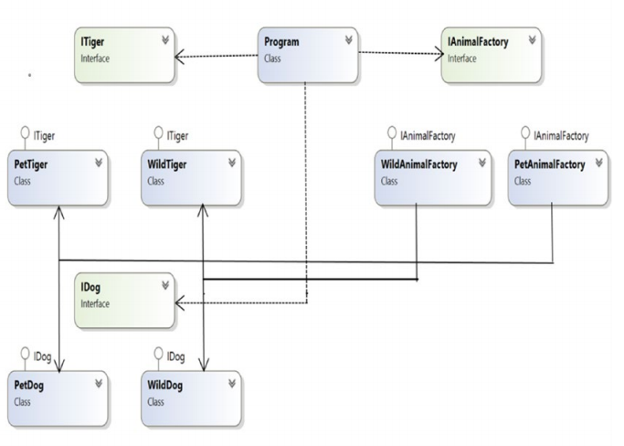
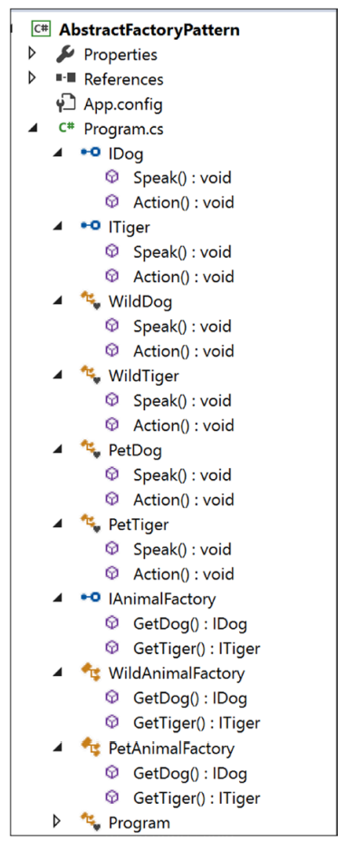

# Chapter 5: Abstract Factory Pattern


**CHÚ Ý**  
CHƯƠNG NÀY VẪN ĐANG ĐƯỢC DỊCH


## GoF Definition

Cung cấp một interface để tạo ra tập hợp các object có liên quan hoặc phụ thuộc lẫn nhau mà không chỉ rõ các lớp cụ thể của chúng \(concrete classes\).


Note: Để hiểu rõ mẫu thiết kế này, tôi đề nghị bạn nên tham khảo [Chương 24](../../part-ii-additional-design-patterns/chapter-24-simple-factory-pattern.md) để tìm hiểu mẫu Simple Factory trước. Tiếp theo là quay lại [Chương 4](chapter-04-factory-method-pattern.md) để tìm hiểu về Factory Method.  
Mẫu Simple Factory không phải là một trong các mẫu thiết kế của Gang of Four, vì vậy việc thảo luận sẽ được trình bày trong Phần II của tài liệu này. Bạn sẽ dễ hiểu mẫu Abstract Factory hơn nếu bạn đã biết mẫu Simple Factory và mẫu Factory Method.


## Khái niệm

Mẫu Abstract Factory được xem là _`factory of factories`_. Với nó, bạn sẽ có một cách để encapsulate \(đóng gói\) một nhóm các factory riêng biệt có chung mục đích, và bạn cũng sẽ không đề cập tới hoặc chỉ rõ các concrete class của chúng.

Mẫu này giúp bạn interchange \(trao đổi/hoán đổi/thay thế\) các implementation \(triển khai/thực hiện\) cụ thể mà không thay đổi code sử dụng chúng, ngay cả lúc runtime. Tuy nhiên, nó có thể dẫn đến sự phức tạp không cần thiết và phải code thêm nhiều. Ngay cả việc debug cũng trở nên khó khăn trong một số trường hợp.

## Ví dụ thực tế

Giả sử bạn đang trang trí phòng của mình với hai loại bàn khác nhau; một cái bằng bằng gỗ và một cái bằng thép. Đối với bàn gỗ, bạn cần đến một thợ mộc, cái kia có thể cần phải đến một cửa hàng kim loại. Tất cả - thím thợ mộc và cửa hàng - đều là factory sản xuất/tạo ra cái bàn. Vì vậy, dựa trên nhu cầu, bạn quyết định factory nào bạn cần.

## Ví dụ chuyên ngành

ADO.NET đã implement một  concept tương tự để thiết lập một connection \(kết nối\) đến một database.

Trong mẫu Factory Method, bạn có 2 factory, một để tạo ra những em Dog, cái còn lại tạo ra mấy em Tiger. Ok, nhưng giờ giả sử bạn muốn phân loại mấy em Dog & Tiger đó thêm, ví dụ như bạn muốn có chó nhà hoặc chó hoang, để đáp ứng nhu cầu đó, bạn sẽ thêm 2 factory nữa, WildAnimalFactory \(cho thú hoang dã\) và PetAnimalFactory \(cho thú nhà - thú cưng\).

## Ví dụ minh họa và giải thích

Wikipedia mô tả một structure điển hình của mẫu này, tương tự như Hình 5-1 \([https://en.wikipedia.org/wiki/Abstract\_factory\_pattern](https://en.wikipedia.org/wiki/Abstract_factory_pattern)\)


Chúng ta sẽ dựa theo structure này để viết code. Bạn sẽ được thấy quá trình xây dựng lên cả động vật hoang dã và mấy em thú cưng. 

Ví dụ này có 2 concrete factory: WildAnimalFactory và PetAnimalFactory. Bạn có lẽ sẽ đoán được rằng chúng có trách nhiệm tạo ra concrete products của Dog and Tiger. WildAnimalFactory thì tạo ra động vật hoang dã \(wild dogs và wild tigers\), còn PetAnimalFactory sẽ tạo ra mấy em thú cưng \(pet dogs và pet tigers\). Tóm tắt lại cho dễ hình dung như vầy:

* IAnimalFactory: Abstract factory. 
* WildAnimalFactory: Concrete factory. Tạo ra wild dogs và wild tigers.
* PetAnimalFactory: Một concrete factory khác. Cái này sẽ tạo ra pet dogs và pet tigers.
* ITiger and IDog: Là các abstract product trong trường hợp này.
* PetTiger, PetDog, WildTiger, and WildDog: Là các concrete product.

### Class Diagram



### Solution Explorer View



### Viết code

```csharp
using System;

namespace AbstractFactoryPattern
{
    public interface IDog
    {
        void Speak();
        void Action();
    }

    public interface ITiger
    {
        void Speak();
        void Action();
    }

    #region Wild Animal collections

    class WildDog : IDog
    {
        public void Speak()
        {
            Console.WriteLine("Cho' hoang sua: Bow-Wow.");
        }

        public void Action()
        {
            Console.WriteLine("Cho' hoang thi'ch di lang thang trong ru`ng.\n");
        }
    }

    class WildTiger : ITiger
    {
        public void Speak()
        {
            Console.WriteLine("Tiger ru`ng hot': Halum.");
        }

        public void Action()
        {
            Console.WriteLine("Tiger ru`ng thich' san moi`.\n");
        }
    }

    #endregion

    #region Pet Animal collections

    class PetDog : IDog
    {
        public void Speak()
        {
            Console.WriteLine("Cho' pet sua: Bow-Wow.");
        }

        public void Action()
        {
            Console.WriteLine("Cho' pet thich' na`m o nha`.\n");
        }
    }

    class PetTiger : ITiger
    {
        public void Speak()
        {
            Console.WriteLine("Tiger trong rap xiec' hot' liu' lo");
        }

        public void Action()
        {
            Console.WriteLine("Tiger trong rap xiec' dien~ xiec'.\n");
        }
    }

    #endregion

    //Abstract Factory
    public interface IAnimalFactory
    {
        IDog GetDog();
        ITiger GetTiger();
    }

    //Concrete Factory-Wild Animal Factory
    public class WildAnimalFactory : IAnimalFactory
    {
        public IDog GetDog()
        {
            return new WildDog();
        }
        public ITiger GetTiger()
        {
            return new WildTiger();
        }
    }

    //Concrete Factory-Pet Animal Factory
    public class PetAnimalFactory : IAnimalFactory
    {
        public IDog GetDog()
        {
            return new PetDog();
        }
        public ITiger GetTiger()
        {
            return new PetTiger();
        }
    }

    class Program
    {
        static void Main(string[] args)
        {
            Console.WriteLine("***Abstract Factory Pattern Demo***\n");

            //Making a wild dog through WildAnimalFactory
            IAnimalFactory wildAnimalFactory = new WildAnimalFactory();
            IDog wildDog = wildAnimalFactory.GetDog(); wildDog.Speak();
            wildDog.Action();

            //Making a wild tiger through WildAnimalFactory
            ITiger wildTiger = wildAnimalFactory.GetTiger();
            wildTiger.Speak();
            wildTiger.Action();

            Console.WriteLine("******************");

            //Making a pet dog through PetAnimalFactory
            IAnimalFactory petAnimalFactory = new PetAnimalFactory();
            IDog petDog = petAnimalFactory.GetDog();
            petDog.Speak();
            petDog.Action();

            //Making a pet tiger through PetAnimalFactory
            ITiger petTiger = petAnimalFactory.GetTiger();
            petTiger.Speak();
            petTiger.Action();

            Console.ReadLine();
        }
    }
}
```

### Output

```text
***Abstract Factory Pattern Demo***

Cho' hoang sua: Bow-Wow.
Cho' hoang thi'ch di lang thang trong ru`ng.

Tiger ru`ng hot': Halum.
Tiger ru`ng thich' san moi`.

******************
Cho' pet sua: Bow-Wow.
Cho' pet thich' na`m o nha`.

Tiger trong rap xiec' hot' liu' lo
Tiger trong rap xiec' dien~ xiec'.
```

## Hỏi Đáp

**Em thấy là mấy cái interface IDog và ITiger đều có các method cùng tên, ví dụ, cả 2 interface đều có phương thức Speak\(\) và Action\(\). Có cần thiết phải vậy không?**

\[...\]

**Có khó khăn gì khi xài mẫu thiết kế này hem?**

\[...\]

**Làm sao để phân biệt mẫu Simple Factory với mẫu Factory Method hoặc mẫu Abstract Factory?**

\[...\]

## Thao khảo thêm

* [Tìm hiểu về Abstract Factory Pattern và các ứng dụng? - vi.fitwp.com](https://vi.fitwp.com/abstract-factory-pattern/)
* [Phỏng vấn 2 mẫu thiết kế Abstract Factory và Factory Pattern - nthoai.blogspot.com](http://nthoai.blogspot.com/2008/06/abstract-factory-and-factory-method.html)
* [Abstract Factory Pattern in C\# - viblo.asia](https://viblo.asia/p/abstract-factory-pattern-in-c-1VgZv9kpKAw)
* [Abstract Factory - nguyenanhtuanweb.wordpress.com](https://nguyenanhtuanweb.wordpress.com/2018/05/29/abstract-factory/)

## Tổng Kết

Nói ngắn gọn, với mẫu Simple Factory, bạn có thể tách rời đoạn code hay thay đổi khỏi phần còn lại \(cơ bản là tách riêng khỏi code Client\). Việc này giúp bạn quản lý code dễ dàng hơn. Một ưu điểm của việc này là Client sẽ không hay biết làm cách nào mà các object được tạo ra. Do đó, code sẽ bảo mật hơn và có vẻ pro hơn, ảo ảo hơn 😅 

Tuy nhiên, cách này vi phạm nguyên lý open-close. Bạn có thể khắc phục bằng cách sử dụng mẫu Factory Method, nó cho phép các lớp con tự quyết định việc khởi tạo như thế nào. Nói một cách đơn giản, bạn ủy thác việc tạo object cho các lớp con, là những class sử dụng factory method để tạo ra object. 

Abstract factory chỉ đơn giản là _`factory of factories`_. Nó tạo ra một tập các object liên quan với nhau, nhưng nó không phụ thuộc vào các concrete class.

Cuối cùng, tôi đã cố giữ các ví dụ thật đơn giản. Một factory method khuyến khích sự kế thừa, và các lớp con của nó cần phải được hiện thực \(implemenent\) factory method để tạo object. Nhưng trong vài trường hợp, bạn có thể thấy rõ rằng mẫu Abstract Factory có thể thúc đẩy việc kết hợp các object bằng cách tạo ra các object liên quan nhau bằng việc sử dụng các phương thức đã lộ ra \(exposed\) trong một factory interface. 

Các factory này đề cao tính "loose coupling" \(liên kết lỏng lẻo\), bằng cách giảm sự phụ thuộc vào các concrete class.

