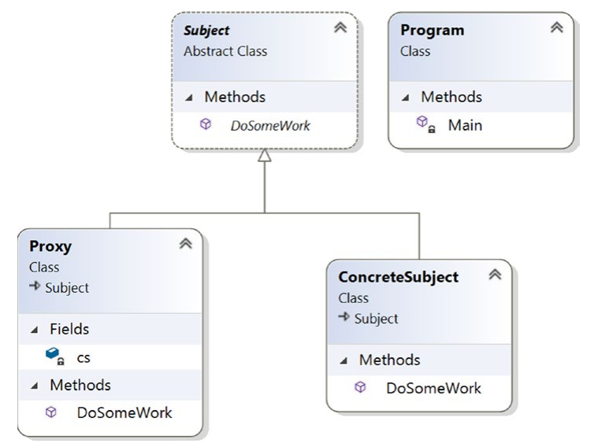
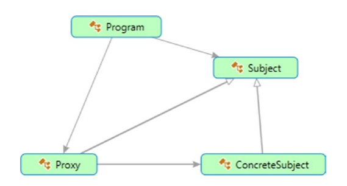
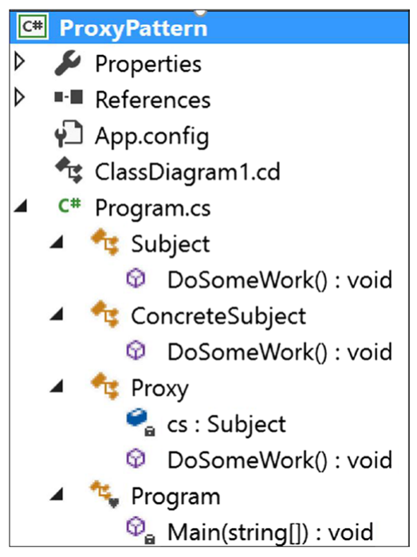
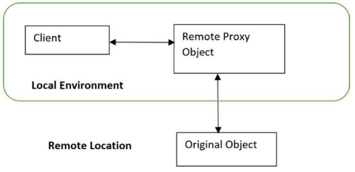

# Chapter 6: Proxy Pattern

## GoF Definition

Cung cấp một thứ thay thế \(surrogate\) hoặc giữ chỗ giùm \(placeholder\) cho một object khác để kiểm soát việc truy cập đến object đó.

## Khái niệm

Một proxy về cơ bản là một thứ thay thế cho một object mà bạn muốn làm việc hoặc dự định làm việc. Khi một Client giao tiếp với một proxy, nó sẽ nghĩ rằng nó đang làm việc trực tiếp với object thực sự. Bạn sẽ phải chơi với  kiểu thiết kế này bởi vì việc xử lý một đối tượng gốc \(original object\) không phải lúc nào cũng có thể. Điều này là do nhiều yếu tố như vấn đề bảo mật chẳng hạn.

## Ví dụ thực tế

Thời sinh viên mình rất hay cúp tiết, lúc điểm danh thầy gọi tên mình, bạn thân của mình có thể sẽ giả giọng mình để điểm danh hộ😅, một người bạn tốt như vậy là một ví dụ điển hình cho mẫu proxy.

## Ví dụ chuyên ngành

Một máy ATM thường sẽ có các proxy object để lấy thông tin của ngân hàng \(nằm trên một remote server\). Trong thế giới lập trình, thực tế, chi phí cho việc tạo ra nhiều instance của một object phức tạp, cồng kềnh và nặng nề nói chung khá đắt đỏ. Do vậy, bất cứ khi nào có thể, bạn nên tạo nhiều proxy object trỏ về original object. Cơ chế này có thể giúp bạn tiết kiệm bộ nhớ của hệ thống.

## Minh họa và giải thích

Trong chương trình này, bạn đang gọi phương thức _`DoSomeWork()`_ của proxy object, từ đây, proxy object sẽ gọi tiếp phương thức _`DoSomeWork()`_ của ConcreteSubject object. Khi người dùng nhìn thấy output, họ sẽ nghĩ rằng họ đang gọi trực tiếp phương thức _`DoSomeWork()`_ của ConcreteSubject object - object thực sự.

### Class Diagram



### Directed Graph Document



### Solution Explorer View

Hình 6-3 hiển thị high-level structure của các thành phần trong chương trình. \(Chú ý là bạn có thể tách proxy class ra một file riêng. Nhưng để cho gọn gàng dễ nhìn, tôi đã đặt mọi thứ vào một file duy nhất\)



### Viết Code

```csharp
using System;

namespace ProxyPattern
{
    /// <summary>
    /// Abstract class Subject
    /// </summary>
    public abstract class Subject
    {
        public abstract void DoSomeWork();
    }

    /// <summary>
    /// ConcreteSubject class
    /// </summary>
    public class ConcreteSubject : Subject
    {
        public override void DoSomeWork()
        {
            Console.WriteLine("ConcreteSubject.DoSomeWork()");
        }
    }

    /// <summary>
    /// Proxy class
    /// </summary>
    public class Proxy : Subject
    {
        Subject cs;
        public override void DoSomeWork()
        {
            Console.WriteLine("Proxy call happening now...");

            //Lazy initialization:We'll not instantiate until the method is called
            if (cs == null)
            {
                cs = new ConcreteSubject();
            }

            cs.DoSomeWork();
        }
    }

    class Program
    {
        static void Main(string[] args)
        {
            Console.WriteLine("***Proxy Pattern Demo***\n");

            Proxy px = new Proxy();
            px.DoSomeWork();

            Console.ReadKey();
        }
    }
}
```

### Output

```text
***Proxy Pattern Demo***

Proxy call happening now...
ConcreteSubject.DoSomeWork()
```

## Hỏi Đáp

**Có các loại proxy nào?**

Có một vài kiểu proxy phổ biến:

* Remote proxy: Kiểu proxy này có thể trỏ tới một đối tượng nằm ở một nơi khác.
* Virtual proxy: Kiểu proxy này thường được sử dụng để thực hiện tối ưu hóa, khi có nhiều lượt truy xuất vào một đối tượng cấu trúc phức tạp, cồng kềnh, chứa dữ liệu lớn \(hình ảnh, video,..\) trường hợp này chúng ta sẽ tạo ra một _`proxy`_ để đại diện cho đối tượng đó. Đối tượng chỉ được tạo ở lần truy xuất đầu tiên sau đó những lần truy xuất tiếp theo chỉ cần tái sử dụng lại mà không cần khởi tạo để tránh trường hợp sao chép ra nhiều đối tượng, vì vậy sẽ tiếp kiệm được nhiều tài nguyên.
* Protection proxy: Proxy dạng này sẽ xử lý những các quyền truy cập khác nhau.
* Smart reference proxy: Thực hiện các kiểm soát các hoạt động bổ sung khi đối tượng được truy cập bởi Client. Một ví dụ là thường proxy sẽ đếm số lượt tham chiếu đến object ở một thời điểm cụ thể.

> Còn rất nhiều kiểu proxy khác, như Monitor Proxy, Firewall Proxy, Cache Proxy, Synchronization Proxy, Copy-On-Write Proxy... mấy bác tự tìm hiểu thêm

  
**Tôi có thể create một instance của ConcreteSubject trong constructor của proxy class như dưới đây, đúng không:**

```csharp
/// <summary>
/// Proxy class
/// </summary>
public class Proxy : Subject
{
    Subject cs;

    public Proxy()
    {
        //Instantiating inside the constructor
        cs = new ConcreteSubject();
    }
    
    public override void DoSomeWork()
    {
        Console.WriteLine("Proxy call happening now..");
        cs.DoSomeWork();
    }
}
```

Uh, bạn có thể làm vậy. Nhưng nếu bạn làm theo thiết kế này, bất cứ khi nào bạn khởi tạo một proxy object, bạn cũng cần phải khởi tạo một đối tượng của lớp ConcreteSubject. Do đó, quá trình này có thể sẽ tạo ra các đối tượng không cần thiết.  


**Nhưng với lazy instantiation, bạn có thể tạo ra các đối tượng không cần thiết trong ứng dụng đa luồng, đúng không?**

Đúng là vậy, nhưng trong tài liệu này do cố tình chỉ đưa ra các mình họa đơn giản nên tôi đã bỏ qua phần đó. Trong phần thảo luận về mẫu Singleton trong [Chương 1](../i-a-creational-patterns/chapter-01-singleton-pattern.md), chúng ta đã phân tích một số phương pháp để xử lý trong môi trường đa luồng, bạn luôn có thể tham khảo cho những trường hợp kiểu này. Ví dụ, trong trường hợp cụ thể này, bạn có thể sử dụng Smart Proxy để đảm bảo rằng một object nào đó bị khóa \(lock\) khi bạn chưa cấp quyền truy cập vào nó.  


**Bạn hãy cho một ví dụ về Remote Proxy?**

Giả sử rằng bạn muốn gọi tới môt method của một object nhưng object đó đang chạy ở một không gian địa chỉ khác nhau \(different address space\), ví dụ một nơi khác hoặc trên một máy tính khác. Làm sao xử lý đây? Với sự trợ giúp của remote proxy, bạn có thể gọi method đó trên proxy object, rồi proxy object sẽ chuyển lời gọi đến object thực sự đang chạy trên remote machine. Những bài toán kiểu này có thể được nhận ra thông qua các cơ chế quen thuộc phổ biến như ASP. NET, CORBA, hay Java’s RMI. Trong các ứng dụng C\#, bạn có thể thực hiện một cơ chế tương tự với WCF \(.NET Framework phiên bản 3.0 trở đi\) hoặc .NET web services/remoting \(chủ yếu được sử dụng trong các phiên cũ\).



**Khi nào thì sử dụng Virtual Proxy?**

Sử dụng Virtual Proxy để tránh việc load một tấm ảnh cưc lớn nhiều lần.  


**Khi nào thì sử dụng Protection Proxy?**

Một vài công ty, họ có thể sử dụng một Protection Proxy để chặn truy cập internet tới một website, ứng dụng cụ thể \(ví dụ chặn skype, liên xô chống mỹ...\).   
  
Hãy xem xét ví dụ sau, cơ bản là sửa đổi một chút cách triển khai mẫu Proxy đã được mô tả trước đó. Để đơn giản hóa, hãy giả sử là bạn chỉ có 3 user có thể xài được proxy method DoSomeWork\(\). Nếu có bất kỳ ông nào khác \(ví dụ Jin\) cố gắng gọi method đó, hệ thống sẽ từ chối truy cập. Khi hệ thống từ chối các truy cập không mong muốn này, thì mình đâu cần phải tao ra các ConcreteSubject object nữa, do đó tránh được việc tạo ra những object không cần thiết.

Giờ hãy xem code đã chỉnh sửa:

```csharp
using System;
using System.Linq;//For Contains() method below

namespace ProxyPatternQAs
{
    /// <summary>
    /// Abstract class Subject
    /// </summary>
    public abstract class Subject
    {
        public abstract void DoSomeWork();
    }

    /// <summary>
    /// ConcreteSubject class
    /// </summary>
    public class ConcreteSubject : Subject
    {
        public override void DoSomeWork()
        {
            Console.WriteLine("ConcreteSubject.DoSomeWork()");
        }
    }

    /// <summary>
    /// Proxy class
    /// </summary>
    public class Proxy : Subject
    {
        Subject cs;
        string[] registeredUsers;
        string currentUser;

        public Proxy(string currentUser)
        {
            //Avoiding to instantiate inside the constructor
            //cs = new ConcreteSubject();
            //Registered users
            registeredUsers = new string[] { "Admin", "Rohit", "Sam" };
            this.currentUser = currentUser;
        }
        public override void DoSomeWork()
        {
            Console.WriteLine("\nProxy call happening now...");
            Console.WriteLine("{0} wants to invoke a proxy method.", 
                currentUser);

            if (registeredUsers.Contains(currentUser))
            {
                // Lazy initialization: We'll not instantiate until the
                // method is called
                if (cs == null)
                {
                    cs = new ConcreteSubject();
                }
                cs.DoSomeWork();
            }
            else
            {
                Console.WriteLine("Sorry {0}, you do not have access.",
               currentUser);
            }
        }
    }

    class Program
    {
        static void Main(string[] args)
        {
            Console.WriteLine("***Proxy Pattern Demo***\n");

            //Authorized user-Admin
            Proxy px1 = new Proxy("Admin");
            px1.DoSomeWork();

            //Unwanted User-Robin
            Proxy px2 = new Proxy("Robin");
            px2.DoSomeWork();

            Console.ReadKey();
        }
    }
}
```

Kết quả sau khi chỉnh sửa:

```text
***Proxy Pattern Demo***

Proxy call happening now...
Admin wants to invoke a proxy method.
ConcreteSubject.DoSomeWork()

Proxy call happening now...
Robin wants to invoke a proxy method.
Sorry Robin, you do not have access.
```

  
**Có vẻ như Proxy hoạt động giống Decorator, phải hem?**

Một Protection Proxy có lẽ được implement như một decorator, nhưng mà ban không nên quên mục đích của một proxy. Decorator tập trung vào việc add thêm tính năng, còn proxy thì tập trung vào việc kiểm soát việc truy cập đến object. Các proxy khác nhau dựa vào mục đích sử dụng và các cách thực hiện, do vậy, nếu bạn có thể nhớ mục đích của chúng, bạn có thể phân biệt được rõ ràng proxy và decorator trong hầu hết mọi trường hợp.

## Tham khảo thêm

* [https://gpcoder.com/4644-huong-dan-java-design-pattern-proxy/](https://gpcoder.com/4644-huong-dan-java-design-pattern-proxy/)
* [https://www.stdio.vn/articles/design-pattern-proxy-pattern-601](https://www.stdio.vn/articles/design-pattern-proxy-pattern-601)
* [https://appstechviet.wordpress.com/2016/08/23/design-pattern-the-proxy-pattern/](https://appstechviet.wordpress.com/2016/08/23/design-pattern-the-proxy-pattern/)
* [https://nixforest.wordpress.com/2010/12/06/design-pattern-proxy/](https://nixforest.wordpress.com/2010/12/06/design-pattern-proxy/)

