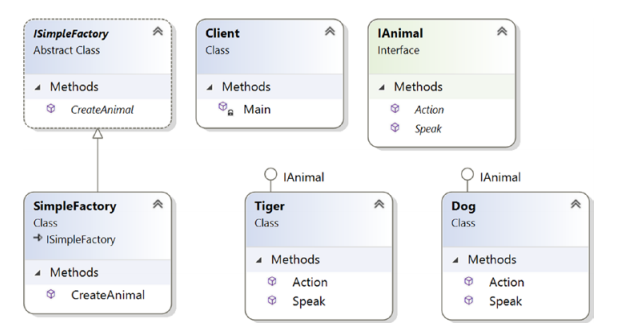
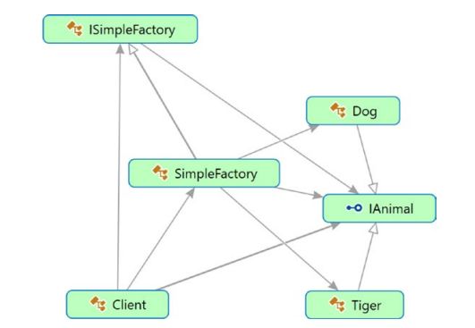
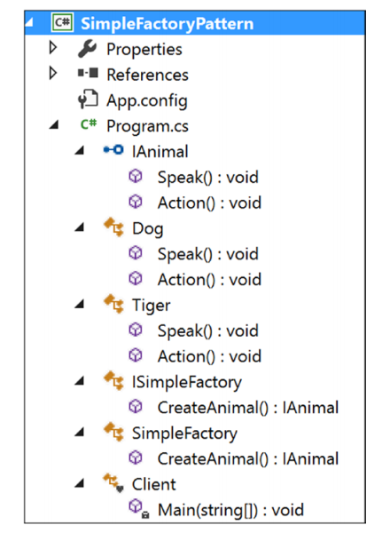
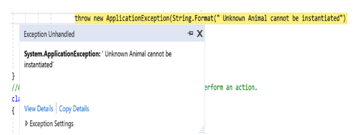

# Chapter 24: Simple Factory Pattern


**LƯU Ý:**  
CHƯƠNG NÀY VẪN CHƯA DỊCH XONG


## Định nghĩa

Tạo ra các đối tượng mà không để lộ việc tạo ra đối tượng đó như thế nào khi sử dụng

## Khái niệm

Trong lập trình hướng đối tượng, một factory là một thứ object mà có thể tạo ra những object khác. Một factory có thể được dùng/được gọi ra bằng nhiều cách khác nhau nhưng thường xuyên nhất là gọi một phương thức mà có thể trả về những object với các nguyên mẫu khác nhau. Bất kỳ subroutine \(chương trình con\) nào mà giúp chúng ta tạo ra những object mới này thì có thể được xem như là một factory. Quan trọng nhất, nó sẽ giúp bạn trừu tượng hóa việc tạo ra object.

## Ví dụ trong thực tế

Trong một nhà hàng ở Nam Ấn Độ, khi bạn order một dĩa Biryani yêu thích, người phục vụ có thể hỏi bạn có muốn Biryani của bạn có thêm hoặc bớt gia vị. Dựa trên yêu cầu của bạn, đầu bếp sẽ điều chỉnh cho phù hợp.

## Ví dụ chuyên ngành

Mẫu Simple Factory rất phổ biến trong các phần mềm ứng dụng, nhưng trước khi đi sâu, bạn nên chú ý những thứ sau đây:

* Mẫu Simple Factory không được xem là mẫu thiết kế tiêu chuẩn trong cuốn sách nổi tiếng GoF, nhưng cách tiếp cận thì khá phổ biến với bất kỳ ứng dụng nào bạn viết nếu bạn muốn tách những đoạn code thay đổi nhiều so với phần code không thay đổi.
* Mẫu Simple Factory được coi là hình thức đơn giản nhất của mẫu _`Factory Method`_ \(và mẫu _`Abstract Factory`_\). Vì vậy, bạn có thể cho rằng bất kỳ ứng dụng nào tuân theo mẫu _`Factory Method`_ hoặc mẫu _`Abstract Factory`_ đều bắt nguồn từ khái niệm về các mục tiêu thiết kế mẫu _`Simple Factory`_.

Chúng ta sẽ thảo luận về mẫu này bằng một trường hợp phổ biến. Chiến thôi.

## Minh họa và giải thích

Có một vài đặc điểm quan trọng dưới đây:

* Trong ví dụ này, bạn đang làm việc với 2 loài vật: Dog và Tiger. Quá trình tạo ra object sẽ phụ thuộc vào input của user
* Bạn có thể giả định rằng loài nào cũng có thể nói \(speak\) và thích làm gì đó \(action\)
* Trong client code, bạn sẽ thấy dòng này: `preferredType = simpleFactory.CreateAnimal();`
* Tôi đã viết code tạo object ở chỗ khác, cụ thể là trong một factory class. Với cách này, bạn sẽ không phải sử dụng từ khóa _`new`_ trong code client
* Bạn có thể cũng sẽ thấy rằng tôi đã tách code có thể thay đổi từ code ít có khả năng thay đổi. Cơ chế này giúp bạn loại bỏ sự liên kết chặt chẽ trong hệ thống \(làm sao được vậy? Đọc thêm phần [Hỏi Đáp](chapter-24-simple-factory-pattern.md#hoi-dap)\)


**Lưu ý:**  
Ở một số nơi, bạn có thể thấy biến thể của mẫu này trong đó các object được tạo thông qua một method có tham số kiểu như _`preferType = simpleFactory.CreateAnimal ("Tiger")`_ và trong đó class factory của bạn không kế thừa từ một abstract class hay interface.


### Class Diagram



### Directed Graph Document



### Solution Explorer View



### Viết Code

```csharp
using System;

namespace SimpleFactoryPattern
{
    public interface IAnimal
    {
        void Speak();
        void Action();
    }

    public class Dog : IAnimal
    {
        public void Speak()
        {
            Console.WriteLine("Dog says: Bow-Wow.");
        }
        public void Action()
        {
            Console.WriteLine("Dogs prefer barking...");
        }
    }

    public class Tiger : IAnimal
    {
        public void Speak()
        {
            Console.WriteLine("Tiger says: Halum.");
        }
        public void Action()
        {
            Console.WriteLine("Tigers prefer hunting...");
        }
    }

    public abstract class ISimpleFactory
    {
        public abstract IAnimal CreateAnimal();
    }

    public class SimpleFactory : ISimpleFactory
    {
        public override IAnimal CreateAnimal()
        {
            IAnimal intendedAnimal = null;
            Console.WriteLine("Enter your choice(0 for Dog, 1 for Tiger)");
            string b1 = Console.ReadLine();
            int input;
            if (int.TryParse(b1, out input))
            {
                Console.WriteLine("You have entered {0}", input);
                switch (input)
                {
                    case 0:
                        intendedAnimal = new Dog();
                        break;
                    case 1:
                        intendedAnimal = new Tiger();
                        break;
                    default:
                        Console.WriteLine("You must enter either 0 or 1");
                        //We'll throw a runtime exception for any other choices.
                        throw new ApplicationException(
                            String.Format(
                                " Unknown Animal cannot be instantiated"));
                }
            }
            return intendedAnimal;
        }
    }

    //A client is interested to get an animal who can 
    //speak and perform an action.
    class Client
    {
        static void Main(string[] args)
        {
            Console.WriteLine("*** Simple Factory Pattern Demo***\n");

            IAnimal preferredType = null;
            ISimpleFactory simpleFactory = new SimpleFactory();

            #region The code region that will vary based on users preference 
            preferredType = simpleFactory.CreateAnimal();
            #endregion

            #region The codes that do not change frequently
            preferredType.Speak();
            preferredType.Action();
            #endregion

            Console.ReadKey();
        }
    }
}
```

### Output

Trường hợp 1, user nhập giá trị 0

```text
***Simple Factory Pattern Demo***
Enter your choice( 0 for Dog, 1 for Tiger)
0
You have entered 0
Dog says: Bow-Wow.
Dogs prefer barking...
```

Trường hợp 2, user nhập giá trị 1

```text
***Simple Factory Pattern Demo***
Enter your choice(0 for Dog, 1 for Tiger)
1
You have entered 1
Tiger says: Halum.
Tigers prefer hunting...
```

Trường hợp 3, user nhập giá trị 3

```text
***Simple Factory Pattern Demo***
Enter your choice(0 for Dog, 1 for Tiger)
3
You have entered 3
You must enter either 0 or 1
And you will receive he folllowing Exception:"Unknown Animal cannot be
instantiated"
```



## Hỏi Đáp

**Trong ví dụ này,  tui thấy là các client đang ủy thác việc tạo đối tượng thông qua mẫu Simple Factory. Nhưng thay vì như vậy, chúng có thể tạo object trực tiếp với keyword** _**`new`**_**. Đúng không?**

Không, có 1 vài lý do sau:

* Một trong những nguyên lý chính trong thiết kế hướng đối tượng là chia tách phần dễ thay đổi khỏi các phần còn lại.

  Trong trường hợp này thì chỉ có quá trình tạo object là thay đổi.   
  Giả dụ rằng phần code ít thay đổi là code qui định động vật phải speak\(\) và thực hiện vài hành động action\(\). Trong tương lại, nếu có yêu cầu thay đổi trong lúc khởi tạo, bạn chỉ cần thay đổi phương thức CreateAnimal\(\) của class SimpleFactory. Client code sẽ không bị ảnh hưởng bởi những thay đổi đó.

* Bạn không muốn viết quá nhiều đoạn if-else \(hoặc switch\) trong phần client, yep, viết như thế thì gà quá.
* How you are creating the objects is hidden from the client code. This kind of abstraction promotes security.

  
**Có khó khăn gì với mẫu thiết kế này hem?**

Nếu bạn muốn thêm hoặc xóa bớt vài em animal, bạn cần phải chỉnh sửa phương thức CreateAnimal\(\). Điều này vi phạm nguyên lý open/closed của SOLID \(cơ bản thì nguyên lý đó nói mình nên đóng cho việc chỉnh sửa và mở cho việc mở rộng\)

**Lưu ý:** Các nguyên lý SOLID  được đề xướng bởi Robert C. Martin. Bạn có thể học thêm ở đây: [https://en.wikipedia.org/wiki/SOLID\_\(objectoriented\_design](https://en.wikipedia.org/wiki/SOLID_%28objectoriented_design)\).  
  
Đại khái ta có thể tóm lược các nguyên lý của SOLID thành một câu như vầy \(cái này từ người dịch 😅\): 

> Nêu code và phân chia projects, features, classes... thành những thành phần nhỏ hơn, chuyên biệt, cô đọng, dễ mở rộng và không nên phụ thuộc lẫn nhau.

  
**Có thể nào bỏ qua** _**`ISimpleFactory`**_ **trong ví dụ trên?**

Lập trình với một abstract class hay một interface luôn là good practice. Cách này có thể giúp bạn tránh nhiều thay đổi trong tương lại bởi vì khi thêm class mới, đơn giản chỉ cần implement interface là xong thông qua tính đa hình. Nhưng nếu bạn chỉ phụ thuộc vào các concrete class \(là class về một thứ cụ thể, những việc cụ thể\) thì bạn cần thay đổi code khi bạn muốn thêm một class mới vào kiến trúc có sẵn, và trong trường hợp đó, bạn lại vi phạm nguyên lý đóng cho việc sửa đổi.

But yes, trong ví dụ này,  bạn có thể đưa tất cả những thứ này trực tiếp vào SimpleFactory concrete class. Bạn không cần trì hoãn việc khởi tạo tới các lớp con. \(Tuy nhiên, đối với mẫu Factory Method thì bắt buộc. Trong ngữ cảnh này, hãy nhớ định nghĩa của GoF: "Factory Method sẽ để các lớp con tự quyết định việc khởi tạo, nói cách khác, nó sẽ để một class trì hoãn việc khởi tạo đến các lớp con"\)

  
**Có thể tạo một** _**`factory`**_ **static class ?**

Bạn có thể, nhưng phải nhớ các hạn chế liên quan đến _`static class`_. Ví dụ như bạn không thể thừa kế chúng, v.v.

## Tham khảo thêm

* [https://appstechviet.wordpress.com/2015/08/03/design-patterns-the-simple-factory-pattern/](https://appstechviet.wordpress.com/2015/08/03/design-patterns-the-simple-factory-pattern/)
* [http://swiftyvn.com/?p=1822](http://swiftyvn.com/?p=1822)

